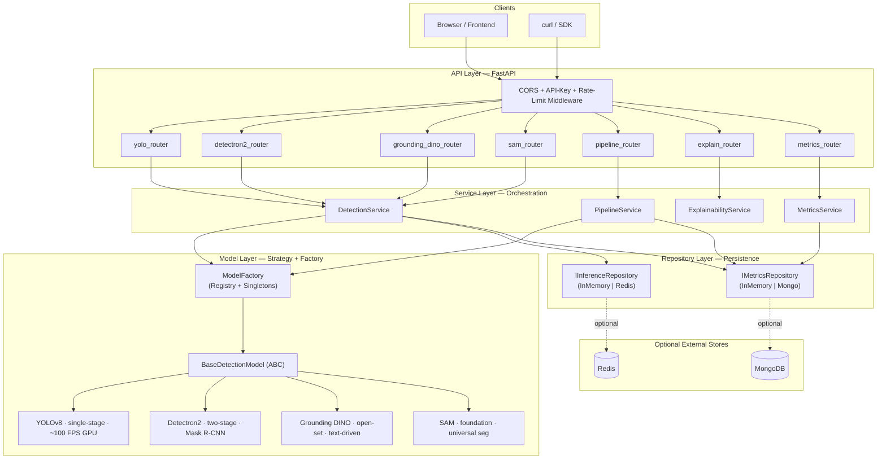
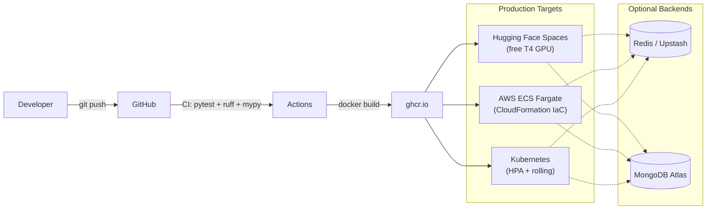
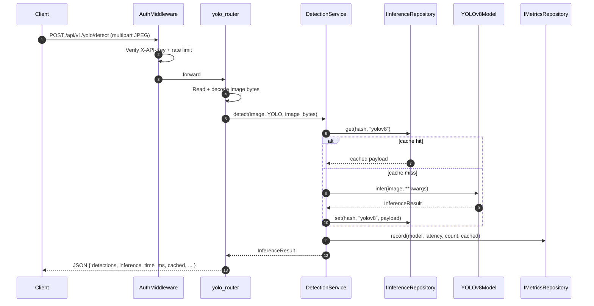
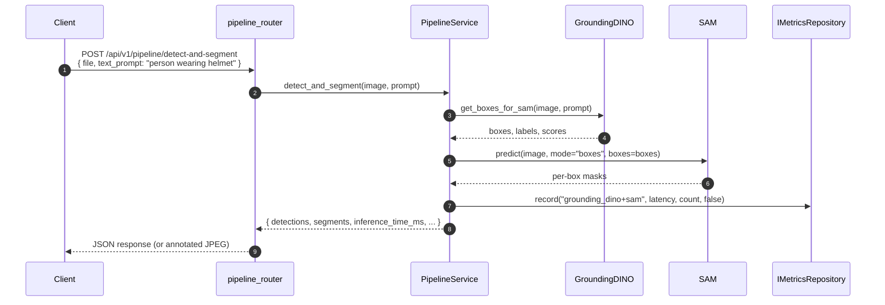
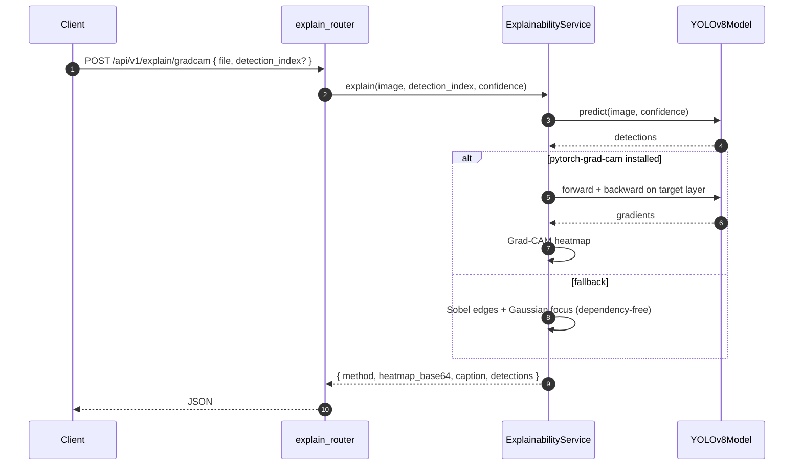

# Unified Object Detection & Segmentation API

> A production-grade FastAPI service that unifies four state-of-the-art computer-vision models — **YOLOv8**, **Detectron2 (Mask R-CNN)**, **Grounding DINO**, and **SAM** — behind a single versioned REST interface, with a layered clean-architecture backend, pluggable caching / metrics backends, API-key auth, and Grad-CAM explainability.

<p align="center">
  <em>Detect anything. Segment anything. Explain anything. All from one endpoint.</em>
</p>

---

## Live demo

| Component | URL | Notes |
|---|---|---|
| **Frontend** (Next.js on Vercel) | <https://object-detection-api-psi.vercel.app> | Always on |
| **Backend** (FastAPI via ngrok tunnel) | <https://unnecessarily-menispermaceous-rickey.ngrok-free.dev> | Live only while the maintainer's laptop is on — see [DEPLOY.md](DEPLOY.md) |
| **API docs (Swagger)** | <https://unnecessarily-menispermaceous-rickey.ngrok-free.dev/docs> | Interactive |
| **Health probe** | <https://unnecessarily-menispermaceous-rickey.ngrok-free.dev/health> | Public |

> The backend URL is an ngrok Free tunnel, which means it rotates when the tunnel restarts. If it doesn't respond, the maintainer's laptop is offline — try again later or set up your own copy in 15 min via [DEPLOY.md](DEPLOY.md).

---

## Table of contents

1. [Highlights](#highlights)
2. [System architecture](#system-architecture)
3. [Request flows](#request-flows)
4. [Project layout](#project-layout)
5. [Getting started](#getting-started)
6. [Frontend](#frontend)
7. [API reference](#api-reference)
8. [Configuration](#configuration)
9. [Deployment](#deployment)
10. [Testing](#testing)
11. [Roadmap](#roadmap)
12. [References](#references)

---

## Highlights

| Capability | Endpoint | Notes |
|---|---|---|
| Real-time object detection | `POST /api/v1/yolo/detect` | YOLOv8, 80 COCO classes, single-stage |
| Low-latency webcam frames | `POST /api/v1/yolo/detect-base64` | Skips multipart round-trip |
| Instance segmentation | `POST /api/v1/detectron2/detect` | Two-stage Mask R-CNN |
| Open-set text detection | `POST /api/v1/grounding-dino/detect` | Any object, described in words |
| Universal segmentation | `POST /api/v1/sam/segment-*` | Auto / points / boxes prompts |
| Text → detect → segment | `POST /api/v1/pipeline/detect-and-segment` | Grounding DINO + SAM pipeline |
| Grad-CAM explainability | `POST /api/v1/explain/gradcam` | Heatmap for a chosen detection |
| Live benchmark dashboard | `GET /api/v1/metrics/summary` | Per-model latency, throughput, cache hits |
| System health | `GET /health` | Per-model load status |

**Non-functional highlights**

- **Clean architecture** — routers → services → repositories → models. Every layer talks only to the layer directly below it.
- **Strategy + Factory** — every model implements `BaseDetectionModel`; new models plug in via `ModelFactory.register()` without touching callers.
- **Pluggable backends** — inference cache defaults to in-memory LRU; swaps to Redis by setting `REDIS_URL`. Metrics default to in-memory ring buffer; persist to MongoDB by setting `MONGO_URL`. Zero code changes.
- **Structured logging** — set `LOG_JSON=true` to emit JSON logs consumable by Datadog / CloudWatch / Loki without regex.
- **Opt-in auth** — API-key middleware + rate limiter guarded behind `AUTH_ENABLED`. Health and docs stay public.
- **Graceful degradation** — Grad-CAM falls back to a Sobel + Gaussian saliency map when `pytorch-grad-cam` is not installed. Redis / Mongo failures degrade to in-memory backends. Optional dependencies are truly optional.
- **CUDA-ready containerization** — multi-stage Dockerfile, ECS Fargate CloudFormation, and Kubernetes manifests with HPA.

---

## System architecture

### Layered view



Each layer only depends on the one below it. Swap the repository backend (Redis → Mongo → in-memory) and neither the routers nor the models notice.

### Deployment view



---

## Request flows

### Standard detection (YOLOv8)



### Open-vocabulary pipeline (Grounding DINO → SAM)



### Grad-CAM explainability



---

## Project layout

```
app/
├── main.py                       # ASGI entry point (create_app factory + lifespan)
├── config.py                     # Pydantic Settings hydrated from env / .env
├── dependencies.py               # FastAPI DI providers (services, repositories)
├── core/
│   └── logging.py                # Structured / plain-text log bootstrap
├── middleware/
│   └── auth.py                   # API-key middleware + rate limiter
├── models/                       # Strategy pattern for CV models
│   ├── base_model.py             #   BaseDetectionModel ABC + Detection / InferenceResult
│   ├── model_factory.py          #   ModelFactory registry + singleton cache
│   ├── yolo_model.py             #   YOLOv8 wrapper
│   ├── detectron2_model.py       #   Mask R-CNN wrapper
│   ├── grounding_dino.py         #   Open-set detector
│   └── sam_model.py              #   Segment Anything Model wrapper
├── repositories/                 # Persistence — routers never see these directly
│   ├── inference_repository.py   #   IInferenceRepository + InMemory / Redis
│   └── metrics_repository.py     #   IMetricsRepository + InMemory / Mongo
├── services/                     # Orchestration
│   ├── detection_service.py      #   Caching + timing + metrics wrapper
│   ├── pipeline_service.py       #   Grounding DINO → SAM pipeline
│   ├── explainability_service.py #   Grad-CAM / saliency
│   └── metrics_service.py        #   Metrics aggregation façade
├── routers/                      # Thin HTTP adapters
│   ├── yolo_router.py            #   + /detect-base64 for webcam
│   ├── detectron2_router.py
│   ├── grounding_dino_router.py
│   ├── sam_router.py
│   ├── pipeline_router.py
│   ├── explain_router.py         #   NEW · Grad-CAM
│   └── metrics_router.py         #   NEW · benchmark dashboard
├── schemas/detection.py          # Pydantic request/response contracts
└── utils/
    ├── image_utils.py            # read_upload_bytes / decode_image_bytes / …
    ├── visualization.py          # draw_detections / draw_masks
    └── annotation_utils.py

deployment/
├── aws/                          # CloudFormation + push scripts (ECS Fargate)
└── k8s/                          # namespace, deployment, service, ingress, HPA

tests/
├── conftest.py                   # shared fixtures
├── test_api.py                   # legacy endpoint contract tests
├── test_repositories.py          # NEW · InMemory cache + metrics
├── test_detection_service.py     # NEW · DetectionService orchestration
└── test_new_endpoints.py         # NEW · /metrics, /detect-base64, /openapi.json
```

---

## Getting started

### Local development

```powershell
git clone <repo-url>
cd object-detection-api

py -m venv .venv
.\.venv\Scripts\Activate.ps1
pip install -r requirements.txt

# Detectron2 is not on PyPI — install from source (see requirements.txt notes)
pip install "git+https://github.com/facebookresearch/detectron2.git"

uvicorn app.main:app --host 0.0.0.0 --port 8000 --reload
```

Swagger UI: <http://localhost:8000/docs> · ReDoc: <http://localhost:8000/redoc> · Health: <http://localhost:8000/health>

### Docker

```bash
# GPU (NVIDIA Container Toolkit required)
docker-compose up --build

# CPU-only
docker-compose --profile cpu up --build
```

### Sanity call

```bash
curl -X POST "http://localhost:8000/api/v1/yolo/detect" \
  -F "file=@sample_images/bus.jpg" \
  -F "confidence=0.25"
```

---

## Frontend

A Next.js 15 + TypeScript + Tailwind UI lives in [`frontend/`](frontend/) with three pages:

- **`/`** — drag-and-drop upload, pick any subset of models, annotated canvas + detections table.
- **`/compare`** — run all four models on the same image in parallel with a latency chart.
- **`/metrics`** — live per-model dashboard (auto-refreshes every 5 s).

```bash
cd frontend
npm install
cp .env.example .env.local     # dev proxy is preconfigured
npm run dev
```

See [`frontend/README.md`](frontend/README.md) for full details and [`DEPLOY.md`](DEPLOY.md) for the HF Spaces + Vercel walkthrough.

---

## API reference

### Detection endpoints

| Method | Path | Purpose |
|---|---|---|
| POST | `/api/v1/yolo/detect` | YOLOv8 detection |
| POST | `/api/v1/yolo/detect-base64` | YOLOv8 detection from a base64 frame (webcam) |
| POST | `/api/v1/yolo/detect-visualize` | Annotated JPEG response |
| POST | `/api/v1/detectron2/detect` | Mask R-CNN detection + masks |
| POST | `/api/v1/detectron2/detect-visualize` | Annotated JPEG response |
| POST | `/api/v1/grounding-dino/detect` | Open-set detection by text prompt |
| POST | `/api/v1/grounding-dino/detect-visualize` | Annotated JPEG response |
| POST | `/api/v1/sam/segment-auto` | SAM automatic mask generator |
| POST | `/api/v1/sam/segment-points` | SAM prompted by click points |
| POST | `/api/v1/sam/segment-boxes` | SAM prompted by bounding boxes |
| POST | `/api/v1/pipeline/detect-and-segment` | Grounding DINO → SAM (open-vocabulary segmentation) |
| POST | `/api/v1/pipeline/detect-and-segment-visualize` | Same + annotated JPEG |

### Explainability + telemetry endpoints

| Method | Path | Purpose |
|---|---|---|
| POST | `/api/v1/explain/gradcam` | Grad-CAM / saliency heatmap for a YOLO detection |
| GET  | `/api/v1/metrics/summary` | Per-model latency + throughput + cache-hit rate |
| GET  | `/api/v1/metrics/recent` | Recent inference records (optionally by model) |
| POST | `/api/v1/metrics/reset` | Wipe the in-memory metrics buffer (for benchmarks) |

### System endpoints

| Method | Path | Purpose |
|---|---|---|
| GET | `/` | API metadata + feature flags |
| GET | `/health` | Liveness / readiness + per-model status |
| GET | `/docs`, `/redoc`, `/openapi.json` | Interactive documentation |

### Example — open-vocabulary pipeline

```bash
curl -X POST "http://localhost:8000/api/v1/pipeline/detect-and-segment" \
  -F "file=@test_image.jpg" \
  -F "text_prompt=person wearing helmet"
```

### Example — Grad-CAM

```bash
curl -X POST "http://localhost:8000/api/v1/explain/gradcam" \
  -F "file=@test_image.jpg" \
  -F "detection_index=0"
```

Returns `{ "method": "grad-cam", "heatmap_base64": "data:image/png;base64,…", "caption": "…", "detections": [ … ] }`.

---

## Configuration

Every setting lives in `app/config.py` and is overridable via environment variables or a `.env` file. The complete list is documented in [`.env.example`](.env.example). The most impactful ones:

| Variable | Default | Effect |
|---|---|---|
| `AUTH_ENABLED` | `false` | Require `X-API-Key` header on protected routes |
| `API_KEYS` | `demo-key-12345` | Comma-separated list of accepted keys |
| `RATE_LIMIT_PER_MINUTE` | `60` | Fixed-window limit per key or client IP |
| `CACHE_ENABLED` | `true` | Use the inference-result cache |
| `REDIS_URL` | *(unset)* | If set, swap in Redis for the inference cache |
| `INFERENCE_CACHE_TTL` | `3600` | Cache TTL, seconds |
| `METRICS_ENABLED` | `true` | Track per-model latency + throughput |
| `MONGO_URL` | *(unset)* | If set, persist metrics to MongoDB |
| `LOG_JSON` | `false` | Emit JSON logs via `structlog` |
| `DEVICE` | `auto` | `auto` / `cuda` / `cpu` |
| `CORS_ORIGINS` | `*` | Comma-separated origins, or `*` |

---

## Deployment

The current live demo runs as **Vercel (frontend) + local FastAPI exposed via ngrok (backend)** — the honest free-tier answer that actually serves inference. Full walkthrough in [`DEPLOY.md`](DEPLOY.md).

### Current live setup (Vercel + ngrok)

- Frontend is a standard Vercel Hobby deployment (`Root Directory: frontend`, one env var `NEXT_PUBLIC_API_BASE_URL`).
- Backend runs locally with `uvicorn app.main:app` and is published through ngrok Free (`ngrok http 8000`).
- The React client always sends the `ngrok-skip-browser-warning` header so ngrok's interstitial doesn't corrupt JSON responses.
- Trade-off: the ngrok URL rotates whenever the tunnel restarts and only serves traffic while the maintainer's laptop is on. Great for interviews / recorded demos, not always-on.

### Alternative: Render.com (persistent, free-tier limited)

- [`render.yaml`](render.yaml) is a Render Blueprint that provisions the Docker web service with the right env vars in one click.
- Render free tier: 512 MB RAM, sleeps after 15 min idle. `/health`, `/docs`, and `/metrics/*` all work; running inference at scale needs the Starter plan ($7/mo, 2 GB) because torch + a loaded model exceeds 512 MB.
- Auto-redeploys on every push to `main`.

### AWS ECS Fargate (CloudFormation)

```bash
cd deployment/aws
./ecr-push.sh          # Build image & push to ECR
./deploy.sh            # Deploy VPC → ALB → ECS Fargate stack
```

See [deployment/aws/README.md](deployment/aws/README.md) for the full IaC walkthrough.

### Kubernetes

```bash
kubectl apply -f deployment/k8s/namespace.yaml
kubectl apply -f deployment/k8s/deployment.yaml
kubectl apply -f deployment/k8s/service.yaml
kubectl apply -f deployment/k8s/ingress.yaml
kubectl apply -f deployment/k8s/hpa.yaml
```

Includes readiness / liveness probes on `/health`, an HPA scaling on CPU + memory, and a rolling-update strategy.

---

## Testing

```bash
pytest -v                      # everything
pytest tests/test_repositories.py -v
pytest tests/test_detection_service.py -v
pytest tests/test_new_endpoints.py -v
```

The suite is designed to run **without any model weights or GPU**. `tests/test_detection_service.py` substitutes a `StubModel` into the `ModelFactory` registry so cache / metrics / DI behaviour is verifiable in seconds.

---

## Roadmap

The [`Improvements.md`](Improvements.md) roadmap tracks the full CV/MLOps trajectory. Backend items completed by this refactor:

- Clean architecture (Strategy · Factory · Repository · Service · DI) — **Phase 9**
- API-key auth + rate limiting — **Phase 6**
- Grad-CAM explainability endpoint — **Phase 10**
- Per-model live metrics + benchmark endpoint — **Phase 11**
- Structured logging — **Phase 9**
- Base64 detect endpoint (webcam-ready) — **Phase 2 preparation**
- Test suite covering services + repositories — **Phase 5**

Still open: Next.js frontend, live demo URL, GitHub Actions CI/CD, video-file inference.

---

## References

- Jocher, G., Chaurasia, A., & Qiu, J. (2023). *Ultralytics YOLOv8*. <https://github.com/ultralytics/ultralytics>
- Wu, Y., Kirillov, A., Massa, F., Lo, W.-Y., & Girshick, R. (2019). *Detectron2*. <https://github.com/facebookresearch/detectron2>
- Liu, S., Zeng, Z., et al. (2023). *Grounding DINO: Marrying DINO with Grounded Pre-Training for Open-Set Object Detection*. arXiv:2303.05499
- Kirillov, A., Mintun, E., et al. (2023). *Segment Anything*. arXiv:2304.02643

---

## Author

**Shefayat E Shams Adib**
Islamic University of Technology (IUT), Dhaka
